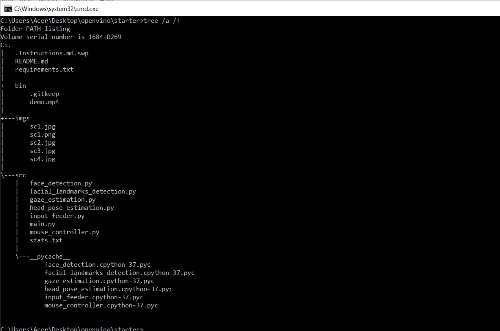
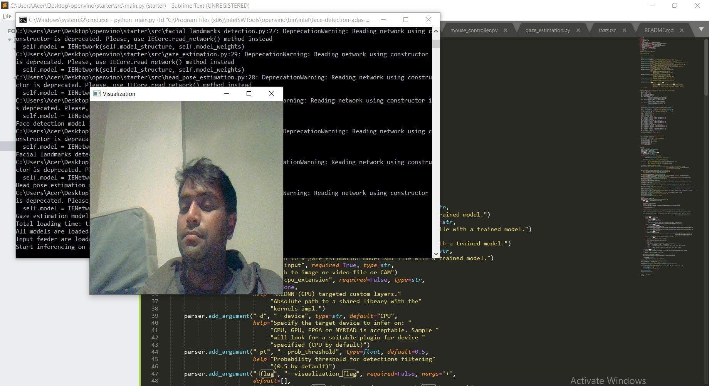
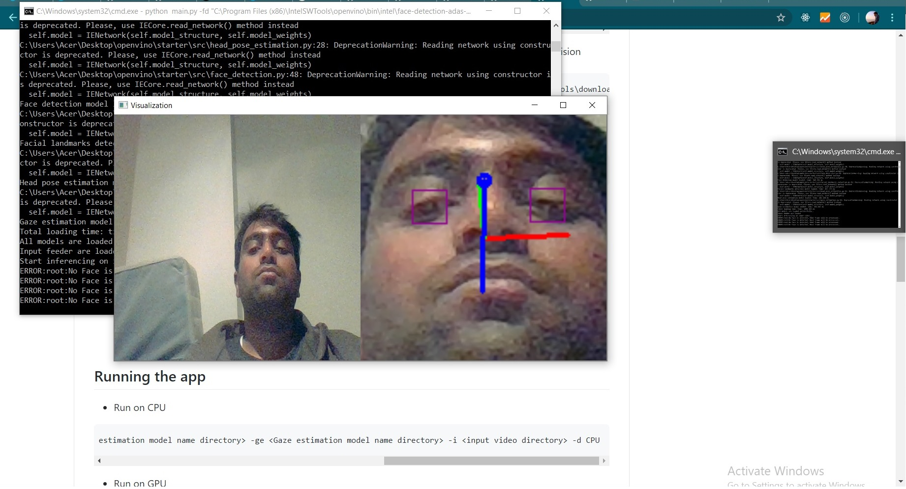

# Computer Pointer Controller

Computer Pointer Controller is an application that uses a gaze detection model to control the mouse pointer using an input video or a live stream from your webcam


## Project Set Up and Installation

### Setup 

#### Install Intel® Distribution of OpenVINO™ toolkit
See this [guide](https://docs.openvinotoolkit.org/latest/) for installing openvino.

#### Intsalling pre-trained models

##### First, you have to initialize openVINO Environment 

* For windows: Open Command Prompt as Admin
```
cd C:\Program Files (x86)\IntelSWTools\openvino\bin\
```
```
setupvars.bat
```

### Downloading Models Inference Files

- [Face Detection Model](https://docs.openvinotoolkit.org/latest/_models_intel_face_detection_adas_binary_0001_description_face_detection_adas_binary_0001.html)
- [Facial Landmarks Detection Model](https://docs.openvinotoolkit.org/latest/_models_intel_landmarks_regression_retail_0009_description_landmarks_regression_retail_0009.html)
- [Head Pose Estimation Model](https://docs.openvinotoolkit.org/latest/_models_intel_head_pose_estimation_adas_0001_description_head_pose_estimation_adas_0001.html)
- [Gaze Estimation Model](https://docs.openvinotoolkit.org/latest/_models_intel_gaze_estimation_adas_0002_description_gaze_estimation_adas_0002.html)

#### How to download the models

Downloading Models 
* Face Detection Model
```
python "C:\Program Files (x86)\IntelSWTools\openvino_2020.3.194/deployment_tools/tools/model_downloader/downloader.py" --name "face-detection-adas-binary-0001"
```

* for landmarks-regression-retail-0009
```
python "C:\Program Files (x86)\IntelSWTools\openvino_2020.3.194/deployment_tools/tools/model_downloader/downloader.py" --name "landmarks-regression-retail-0009"
```
* for head-pose-estimation-adas-0001
```
python "C:\Program Files (x86)\IntelSWTools\openvino_2020.3.194/deployment_tools/tools/model_downloader/downloader.py" --name "head-pose-estimation-adas-0001"
```

* for gaze-estimation-adas-0002
```
python "C:\Program Files (x86)\IntelSWTools\openvino_2020.3.194/deployment_tools/tools/model_downloader/downloader.py" --name "gaze-estimation-adas-0002"
```

## Arguments Documentation 

Following are commanda line arguments that can use for while running the main.py file ` python main.py `:-
```
  1. -h                : Get the information about all the command line arguments
  2. -fd    (required) : Specify the path of Face Detection model's xml file
  3. -fl    (required) : Specify the path of Facial landmarks Detection model xml file
  3. -hp    (required) : Specify the path of Head Pose Estimation model's xml file
  4. -ge     (required) : Specify the path of Gaze Estimation model's xml file
  5. -i     (required) : Specify the path of input video file or enter cam for taking input video from webcam
  6. -d     (optional) : Specify the target device to infer the video file on the model. Suppoerted devices are: CPU, GPU,                            FPGA (For running on FPGA used HETERO:FPGA,CPU), MYRIAD.
  7. -l     (optional) : Specify the absolute path of cpu extension if some layers of models are not supported on the device.
  9. -pt  (optional) : Specify the probability threshold for face detection model to detect the face accurately from video frame.
  8. -flag (optional) : Specify the flags from fd, fld, hp, ge if you want to visualize the output of corresponding models                           of each frame (write flags with space seperation. Ex:- -flags fd fld hp).

```

## Running the app

- Run on CPU 

```
python <main.py directory> -fd <Face detection model name directory> -fl <Facial landmark detection model name directory> -hp <head pose estimation model name directory> -ge <Gaze estimation model name directory> -i <input video directory> -d CPU
```

- Run on GPU 

```
python <main.py directory> -fd <Face detection model name directory> -fl <Facial landmark detection model name directory> -hp <head pose estimation model name directory> -ge <Gaze estimation model name directory> -i <input video directory> -d GPU
```

- Run on FPGA 

```
python <main.py directory> -fd <Face detection model name directory> -fl <Facial landmark detection model name directory> -hp <head pose estimation model name directory> -ge <Gaze estimation model name directory> -i <input video directory> -d HETERO:FPGA,CPU
```

- Run on NSC2

```
python <main.py directory> -fd <Face detection model name directory> -fl <Facial landmark detection model name directory> -hp <head pose estimation model name directory> -ge <Gaze estimation model name directory> -i <input video directory> -d MYRIAD
```

## Directory Structure of the project 


- src folder contains all the source files:-
  * face_detection.py 
     - Contains preprocession of video frame, perform infernce on it and detect the face, postprocess the                          outputs.
     
  * facial_landmarks_detection.py
     - Take the deteted face as input, preprocessed it, perform inference on it and detect the eye landmarks, postprocess the outputs.
     
  * head_pose_estimation.py
     - Take the detected face as input, preprocessed it, perform inference on it and detect the head postion by predicting yaw - roll - pitch angles, postprocess the outputs.
     
  * gaze_estimation.py
     - Take the left eye, right eye, head pose angles as inputs, preprocessed it, perform inference and predict the gaze            vector, postprocess the outputs.
     
  * input_feeder.py
     - Contains InputFeeder class which initialize VideoCapture as per the user argument and return the frames one by one.
     
  * mouse_controller.py
     - Contains MouseController class which take x, y coordinates value, speed, precisions and according these values it            moves the mouse pointer by using pyautogui library.
  * main.py
     - Users need to run main.py file for running the app.
 
- bin folder contains demo video which user can use for testing the app and director structure image.


## Demo

### Running on CPU

```
python main.py -fd "C:\Program Files (x86)\IntelSWTools\openvino\bin\intel\face-detection-adas-binary-0001\FP32-INT1\face-detection-adas-binary-0001" -fl "C:\Program Files (x86)\IntelSWTools\openvino\bin\intel\landmarks-regression-retail-0009\FP16\landmarks-regression-retail-0009" -hp "C:\Program Files (x86)\IntelSWTools\openvino\bin\intel\head-pose-estimation-adas-0001\FP16\head-pose-estimation-adas-0001" -ge "C:\Program Files (x86)\IntelSWTools\openvino\bin\intel\gaze-estimation-adas-0002\FP16\gaze-estimation-adas-0002"  -i C:\Users\Acer\Desktop\openvino\starter\bin\demo.mp4 -d CPU
```


### Running on CPU with Camera
```
python main.py -fd "C:\Program Files (x86)\IntelSWTools\openvino\bin\intel\face-detection-adas-binary-0001\FP32-INT1\face-detection-adas-binary-0001" -fl "C:\Program Files (x86)\IntelSWTools\openvino\bin\intel\landmarks-regression-retail-0009\FP16\landmarks-regression-retail-0009" -hp "C:\Program Files (x86)\IntelSWTools\openvino\bin\intel\head-pose-estimation-adas-0001\FP16\head-pose-estimation-adas-0001" -ge "C:\Program Files (x86)\IntelSWTools\openvino\bin\intel\gaze-estimation-adas-0002\FP16\gaze-estimation-adas-0002"  -i CAM -d CPU
```


### Running on CPU with Camera with Visualisations
```
python main.py -fd "C:\Program Files (x86)\IntelSWTools\openvino\bin\intel\face-detection-adas-binary-0001\FP32-INT1\face-detection-adas-binary-0001" -fl "C:\Program Files (x86)\IntelSWTools\openvino\bin\intel\landmarks-regression-retail-0009\FP16\landmarks-regression-retail-0009" -hp "C:\Program Files (x86)\IntelSWTools\openvino\bin\intel\head-pose-estimation-adas-0001\FP16\head-pose-estimation-adas-0001" -ge "C:\Program Files (x86)\IntelSWTools\openvino\bin\intel\gaze-estimation-adas-0002\FP16\gaze-estimation-adas-0002"  -i CAM -d CPU -flag fl fd ge
```



## Benchmarks

Hardware configuration: Intel Core i5-8250U 1.6Ghz with Turbo Boost upto 3.4 GHz CPU

The models were ran in the above configuration

## Results

### Model Size

* **face-detection-adas-binary-0001**
| Type         | Size of Model |
|--------------|---------------|
|  FP32-INT1   |  1.86M        |

* **head-pose-estimation-adas-0001**
| Type         | Size of Model |
|--------------|---------------|
|  FP16   |  3.69M       |
|  FP16-INT8   |  2.05M        |
|  FP32   |  7.34M        |

* **landmarks-regression-retail-0009**
| Type         | Size of Model |
|--------------|---------------|
|  FP16   |  413KB      |
|  FP16-INT8   | 314KB        |
|  FP32   |  786KB       |

* **gaze-estimation-adas-0002**
| Type         | Size of Model |
|--------------|---------------|
|  FP16   |  3.65M        |
|  FP16-INT8   |  2.05M      |
|  FP32   |   7.24M       |


### Model Performance

#### Combo 1
```
python main.py -fd "C:\Program Files (x86)\IntelSWTools\openvino\bin\intel\face-detection-adas-binary-0001\FP32-INT1\face-detection-adas-binary-0001" -fl "C:\Program Files (x86)\IntelSWTools\openvino\bin\intel\landmarks-regression-retail-0009\FP16\landmarks-regression-retail-0009" -hp "C:\Program Files (x86)\IntelSWTools\openvino\bin\intel\head-pose-estimation-adas-0001\FP16\head-pose-estimation-adas-0001" -ge "C:\Program Files (x86)\IntelSWTools\openvino\bin\intel\gaze-estimation-adas-0002\FP16\gaze-estimation-adas-0002"  -i C:\Users\Acer\Desktop\openvino\starter\bin\demo.mp4 -d CPU
```

* Total loading time: 1559.211 ms
* Total Inference time :  88.2 seconds
* FPS :  0.6689342403628118 frame/second

|Model|	Type|Load Time in Sec|
|---|---|---|
|face-detection-adas-binary-0001| FP32-INT1 |564.251 ms|
|head-pose-estimation-adas-0001 | FP16 |282.284 ms|
|landmarks-regression-retail-0009 | FP16 | 267.775 ms|
|gaze-estimation-adas-0002 - FP16 | 369.647 ms|

#### Combo 2

```
python main.py -fd "C:\Program Files (x86)\IntelSWTools\openvino\bin\intel\face-detection-adas-binary-0001\FP32-INT1\face-detection-adas-binary-0001" -fl "C:\Program Files (x86)\IntelSWTools\openvino\bin\intel\landmarks-regression-retail-0009\FP32\landmarks-regression-retail-0009" -hp "C:\Program Files (x86)\IntelSWTools\openvino\bin\intel\head-pose-estimation-adas-0001\FP32\head-pose-estimation-adas-0001" -ge "C:\Program Files (x86)\IntelSWTools\openvino\bin\intel\gaze-estimation-adas-0002\FP32\gaze-estimation-adas-0002"  -i C:\Users\Acer\Desktop\openvino\starter\bin\demo.mp4 -d CPU
```

* Total loading time: 1603.055 ms
* Total Inference time :  88.3 seconds
* FPS : 0.6681766704416762 frame/second

|Model|	Type|Load Time in Sec|
|---|---|---|
|face-detection-adas-binary-0001| FP32-INT1 |571.465 ms|
|head-pose-estimation-adas-0001 | FP32 |367.234 ms|
|landmarks-regression-retail-0009 | FP32 | 267.775 ms|
|gaze-estimation-adas-0002 - FP32 |  336.397 ms|


#### Combo 3
```
python main.py -fd "C:\Program Files (x86)\IntelSWTools\openvino\bin\intel\face-detection-adas-binary-0001\FP32-INT1\face-detection-adas-binary-0001" -fl "C:\Program Files (x86)\IntelSWTools\openvino\bin\intel\landmarks-regression-retail-0009\FP16-INT8\landmarks-regression-retail-0009" -hp "C:\Program Files (x86)\IntelSWTools\openvino\bin\intel\head-pose-estimation-adas-0001\FP16-INT8\head-pose-estimation-adas-0001" -ge "C:\Program Files (x86)\IntelSWTools\openvino\bin\intel\gaze-estimation-adas-0002\FP16-INT8\gaze-estimation-adas-0002"  -i C:\Users\Acer\Desktop\openvino\starter\bin\demo.mp4 -d CPU
```

* Total loading time: 1881.985 ms
* Total Inference time :  87.1 seconds
* FPS : 0.6681766704416762 frame/second

|Model|	Type|Load Time in Sec|
|---|---|---|
|face-detection-adas-binary-0001| FP32-INT1 |576.440 ms|
|head-pose-estimation-adas-0001 | FP16-INT8 |471.807 ms|
|landmarks-regression-retail-0009 | FP16-INT8 | 301.241 ms|
|gaze-estimation-adas-0002 | FP16-INT8 |  528.826 ms|


## Stand Out Suggestions

Compared their performances by inference time, frame per second and model loading time.

- We ran models with different precision, but precision affects the accuracy. Model size can reduce by lowing the precision from FP32 to FP16 or INT8 and inference becomes faster but because of lowing the precision model can lose some of the important information because of that accuracy of model can decrease. 

- So when we use lower precision model then you can get lower accuracy than higher precision model.
- For FP16-INT8, i found that it was quite good picking up the gaze and head eastimation though giving error when stuck at the corner of screen.
- Though i didnt use any VPU/GPU or hybrids, but we can say the still in Intel i5 the inference speed is good.


### Edge Cases
1. The lighting matters greatly for the video feed, so sometimes models does not clearly views the gaze.

2. If for some reason model can not detect the face then it throws off track and pointer continues in same direction.

3. If there are more than one face detected in the frame then model takes the first detected face for control the mouse pointer.
